Kayaking with floodwater on the river Rhine in Arnhem
================

On a sunny winter day in January we went on a kayak trip to Meinerswijk. Meinerswijk is a nature area and a flood retention basin for the River Rhine in Arnhem. Meinerswijk is with normal water levels the backyard where lots of folks take their daily/weekly jog. This time of the year the water was at a higher peak than usually, but we unfortunately failed to make a full round in the flooded nature area.

However to my surprise the kayakers who left a bit later that day rounded Meinderswijk as shown on the map. 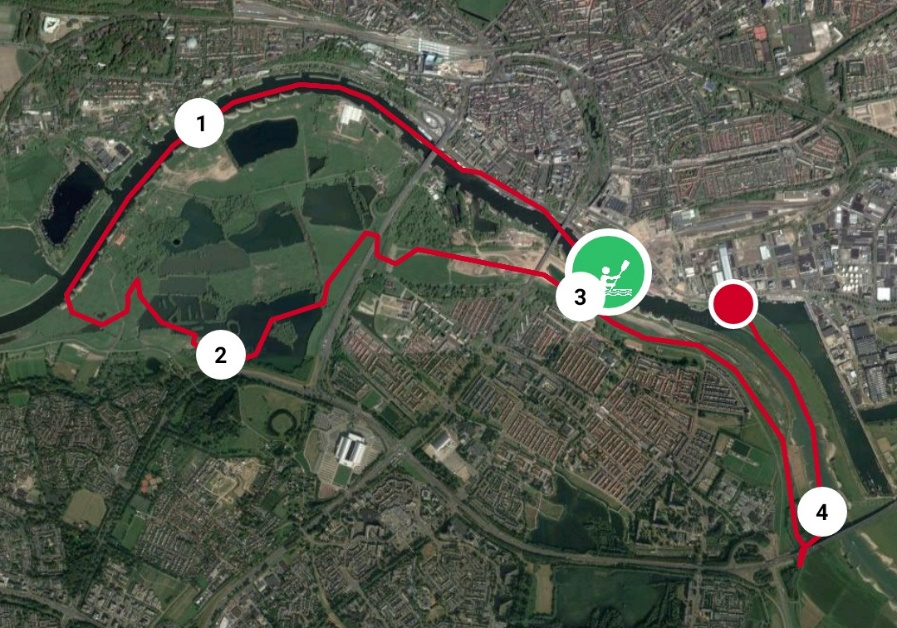 gpx route from a kayak member of Jason

Back home, it was immediately obvious, we went to the left too early (around point 1). This is the regular entry point with normal water levels. I should have known this as it is my personal backyard. But could I have known where I could kayak based on the water level?

Before we continue with the digital yourney, first a list of the technical topics featured within this article:

-   R
    -   Cumulative Cost function
    -   Conversion Raster to Polygon
    -   WMS & Leaflet
    -   WCS
-   Power BI
    -   Custom Visual
        -   “Image by Cloudscope”
        -   “Card with States by OkViz”
    -   Import web data
    -   Custom Function
-   Google Earth Engine
-   QGIS
-   PDOK
-   DEM, DTM, AHN2, AHN3
-   GDAL
-   PlantUML

All the code is on Github, and the URL to the Google Earth Engine script is provided. All the links are provided at the end of this article. It is written in the form of technical journey, with a practical purpose, to gain inside where we can kayak in Arnhem with floodwater.

Power BI
--------

The actual water levels and throughput at Arnhem are visible on the website of Rijkswaterstaat, the department of Public Works. This information is vital for us as at some levels we are not allowed to be on the water for safety reasons. For rowers it is not allowed to be on the water with a throughput above 1100 m³/s. For kayakers there is no official limit though, we can use the areas on the side to go more easily stream upwards. The information used to be at the following location: [Rijkswaterstaat old](https://www.rijkswaterstaat.nl/apps/geoservices/rwsnl/awd.php?mode=html&projecttype=waterstanden&category=1&loc=ARNH&net=LMW). Though recently Rijkswaterstaat changed it to: [Rijkswaterstaat](https://waterinfo.rws.nl/#!/details/publiek/waterhoogte-t-o-v-nap/1868/).

But with this information we still don’t know where we can kayak with floodwater. My supposed solution was pretty simple, if we know the elevation of the land and the water level we know where to kayak. This is of course a little bit simplistic… (I am not a canal and port engineer).

What do we need to create this solution:

-   A regular feed with the actual and expected water levels in the Rhine near Arnhem

-   DEM, digital elevation model, preferable a DTM, digital terrain model, with a high resolution

*The DTM is important. The DTM gives the height at the ground and not the canopy height of the trees.*

Of course, we are going to see whether we can fix it with Microsoft technology. In Power BI it is relatively easy to get a ‘live’ data feed with the water levels. In our case we are not interested in building up history of the measures so it is fine. If historical measures are necessary, a possible solution is to use Azure.

In Power BI it is possible to refresh the data at multiple times a day. In our case a few times a day is fine. If a continuous data stream is necessary, then it is possible to realize this within Azure.

The DEM data is also easy to acquire, but this is unfortunately not possible to import in Power BI (raster/image data). It is an option to use shapefiles or images with the flooded area at a certain level. The DEM isn’t changing on a frequent basis so static data is fine here. The initial used DEM data dates from 2007-2012 (AHN2) and another DEM from a satellite is from 2000.

I choose to visualize the flooded area with images. This solution is relatively easy in Power BI. You map a specific water level on a specific image with the flooded area. This can be used in Power BI with a custom visual “Image by Cloudscope”. Be careful this image is an URL and should be accessible. The shapefile solution didn’t look ideal, but it was possible to upload the flooded area’s to ARCGis online and use them as a layer in the reports. Whether this is ideal, I don’t know.

The final Power BI-report is shown in the next image, including water temperature, throughput and an estimated flow rate in km/h based on the estimated area below the surface of the river. For the 4 cards the custom visual “Card with States by OkViz” is used.

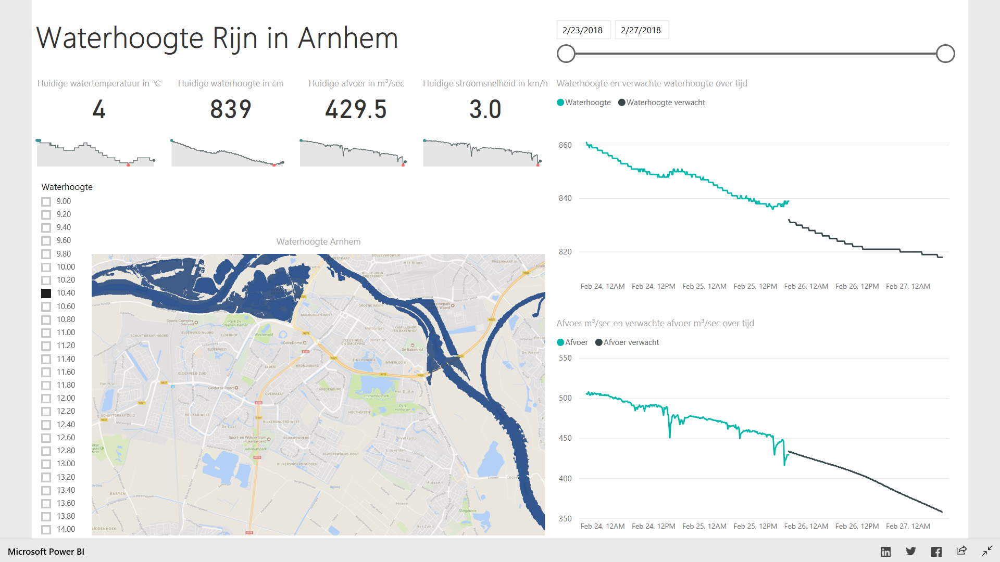

Actual and expected water levels in the Rhine near Arnhem + image (Google Maps!) of the flooded areas where to kayak

The good thing about this Power BI-solution is it simplicity. The Power BI part is not spectacular, in the IT this is usually a good thing someone ones told me. A custom function is used to translate the Date column into a Date column which can be interpreted as a Date type. This date notation is used everywhere, hence the custom function. Though it is currently a bit cumbersome to create a custom function in Power BI. You need a parameter and just a query to be able to create a custom function.

Mapping Floodedwater
--------------------

In the next parts I will explain step by step how the Google Map images in Power BI are made. At this point we officially leave the Microsoft stack. The images themselves are made using QGIS. In QGIS the generated TIF images are combined with a basemap, in this case Google Maps. After a little layout crafting, transparancy 25% and color dark blue, the png images of the flooded areas were exported to a web location where Power BI could access it. The reason to use QGIS was simple as it was not possible to do this with Google Earth Engine.

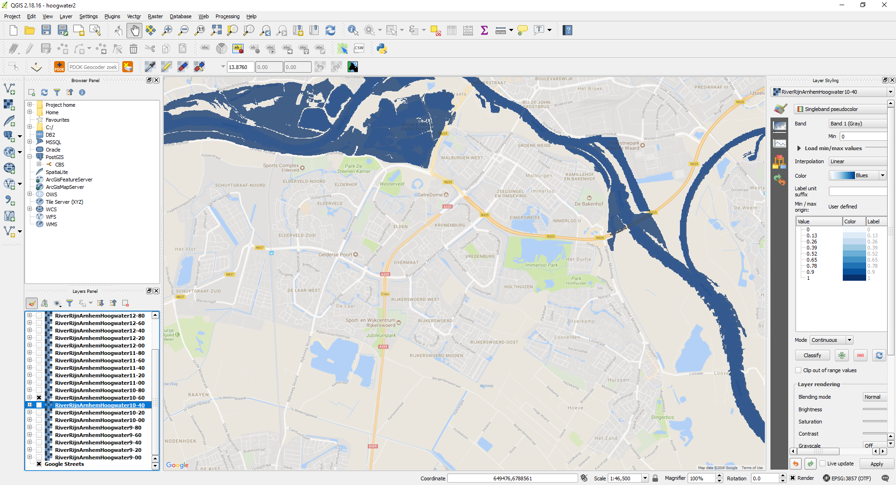 QGIS with the TIF and the basemap

I admit I set the transparancy and the dark blue colour in the layers manually for all the different layers. I am not going to win the beauty contest here. It is not particularly difficult to use a Python or R script in QGIS to realize this. But I normally use QGIS as an Exploratory Data Analysis tool and not so much as the main tool in the chain. I prefer to automate everything with a commandline tool like R. But this is of course a lousy excuse...

The following scheme shows the steps to create the TIF images which QGIS uses.

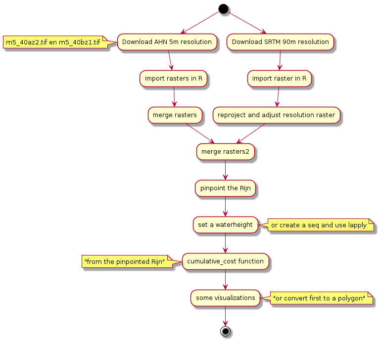

Scheme to go from the raw DEM files to a flooded area in the Rhine (made using PlantUML)

I choose to use water levels between 9m and 14m with increases of 0.2m. This lead to 26 TIF images.

Google Earth Engine
-------------------

The TIF images are made with Google Earth Engine. We show a few screenshots with the code. If you have an GEE account and want to run it yourself you can go to: [GEE link](https://code.earthengine.google.com/234fae4c5055778f436e4e627d073721).

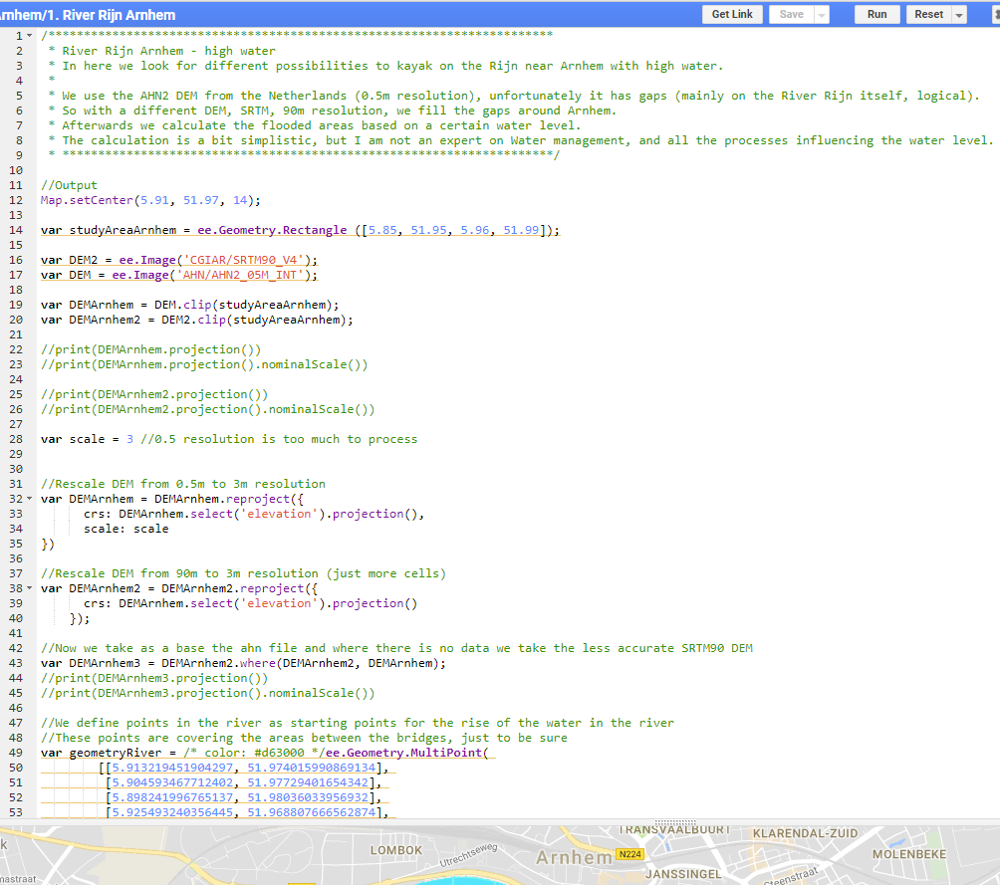 GEE, Google Earth Engine Playground Javascript, part 1 River Rhine Arnhem

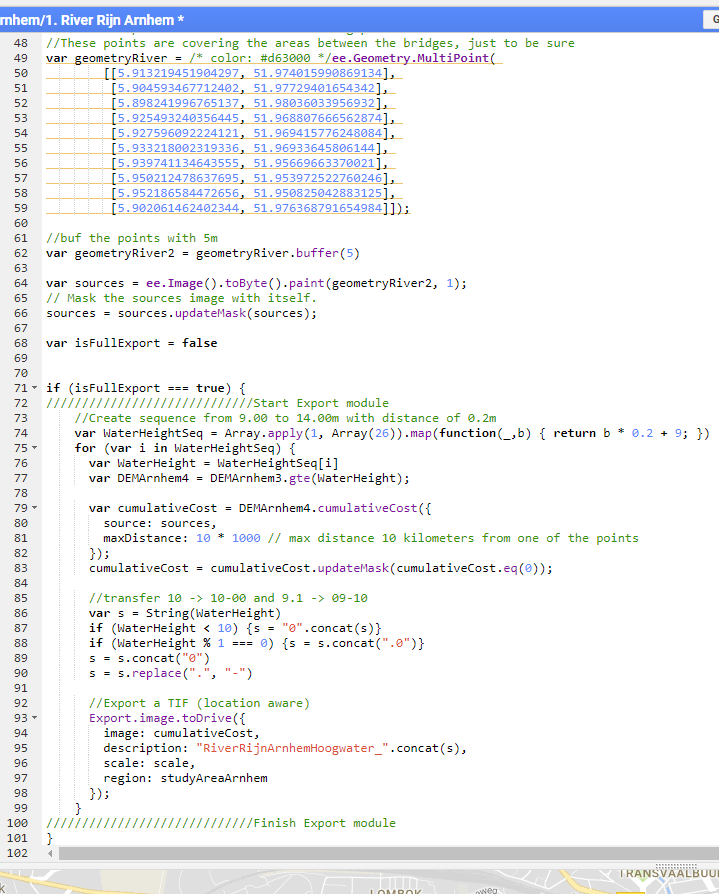

GEE, Google Earth Engine Playground Javascript, part 2 of the River Rhine Arnhem

The ee.objects are created server side, for example cumulativeCost. The created object lives temporarily (during execution) in the Google Cloud. The code uses the cumulative cost function in GEE. The cumulative cost function starts from the river and simple go as far as you can until you find a piece of land (rastercel) which is higher than the water level.

GEE can be used with Python instead of JavaScript (in image above), it remains a server-side object though.

The JavaScript code parts like the for loop run locally. Only by exporting you can save a result from GEE and use it locally. The exported TIF images are used within QGIS as demonstrated above. It is also possible to visualize the result in GEE. If performance is an issue first export the TIF images to GEE itself. In a new JavaScript file you can load these images and visualize them. In this case there is no need to rerun all the preprocessing code again and again. When exporting data out of GEE, the only disadvantage is the lack of possibilities to export the Google Maps basemap with the image layer. This is not that strange though. 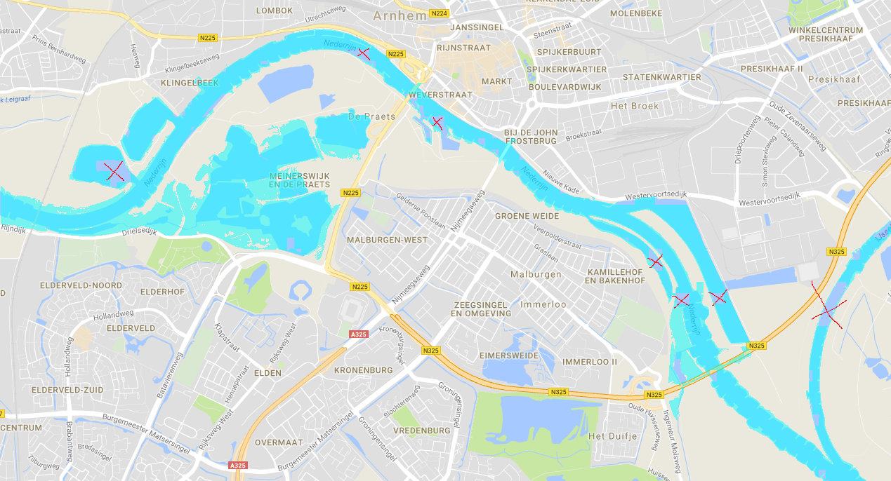

Visualization in GEE of water level 10.20m

The results are far from ideal unfortunately, most remarkable are the ‘gaps’ in the river. The merged DEM confirms the gaps, the 90m resolution DEM is too inaccurate. We need to look for a different solution. *With hindsight we could skip the inaccurate DEM and just use elevation 0m for the unknown areas, mainly the river itself and some buildings.*

We are not obliged to use GEE. GEE has certain restrictions, license, in the use as well. Let’s see whether we can create it as well in R.

R
-

R fits better on the Microsoft stack, let’s see whether we can manage to get a similar or better result. In R similar preprocessing steps are used as in GEE.

The data for the SRTM 90m resolution comes from the CIAT-CSI SRTM website, [CIAT-CSI](http://srtm.csi.cgiar.org). The AHN3 5m resolution can be found on [PDOK - AHN3](https://www.pdok.nl/nl/ahn3-downloads). This is a newer version than the one used in GEE, AHN2. But AHN3 is still work in progress. Arnhem North (above the river Rhine) is not yet available.

In GEE a higher resolution was supported with 0.5x0.5m instead of 5mx5m for a single pixel. It was possible to use locally an 0.5m resolution as well, but for performance reason I sticked to the 5m resolution. 5m resolution seemed good enough and in GEE we reduced the resolution to 3m.

R Code
------

Lets look into some R code first.

``` r
library(gdalUtils)
library(XML)
library(mapview)
library(sf)
library(gdistance)
library(raster)
library(rgdal)
library(ggplot2)
library(ggmap)
library(dplyr)
library(leaflet)
library(sp)
library(leaflet.extras)
library(stringr)
```

DEM, Digital Elevation Model
----------------------------

Download files from <https://www.pdok.nl/nl/ahn3-downloads>.

Load 5m DEM files:

-   m5\_40bz1.tif DTM Arnhem South East

-   m5\_40bz2.tif DTM Arnhem South West

The North side of Arnhem (above the river Rijn) is not yet available in AHN3 (the newest DEM information)

``` r
DTM_Arnhem_SW <- raster("input/m5_40az2.tif")
DTM_Arnhem_SE <- raster("input/m5_40bz1.tif")
#DTM_Arnhem_SW <- raster("input/m_40az2.tif") #high resolution 0.5m, not used
#DTM_Arnhem_SE <- raster("input/m_40bz1.tif") #high resolution 0.5m, not used
```

Merge these 2 rasters into 1 raster

``` r
#I like to see values when printing the raster layer, including the min en max
values(DTM_Arnhem_SW) <- values(DTM_Arnhem_SW)
values(DTM_Arnhem_SE) <- values(DTM_Arnhem_SE)

#Create extent for combining the South East and South West of Arnhem
extendArnhem = merge(extent(DTM_Arnhem_SW),extent(DTM_Arnhem_SE))

#create a raster with the combined extent, and the resolution 5m
rasterArnhem <- raster(extendArnhem, crs = DTM_Arnhem_SE@crs, resolution = c(5, 5))

DTM <- merge(rasterArnhem, DTM_Arnhem_SW)
DTM <- merge(DTM, DTM_Arnhem_SE)

plot(DTM_Arnhem_SW)
```

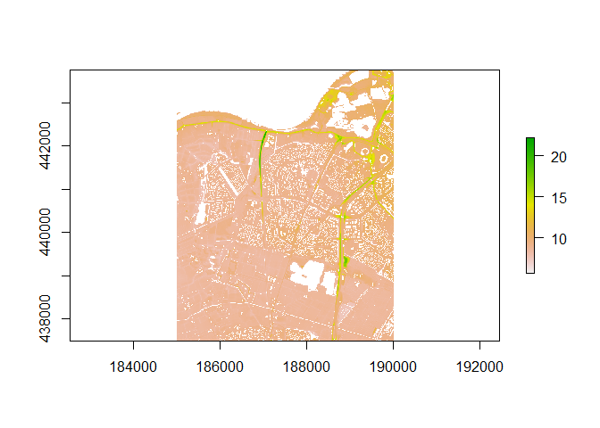

``` r
plot(DTM_Arnhem_SE)
```

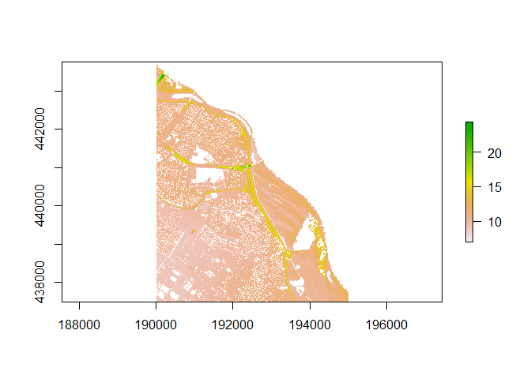

``` r
plot(DTM)
```

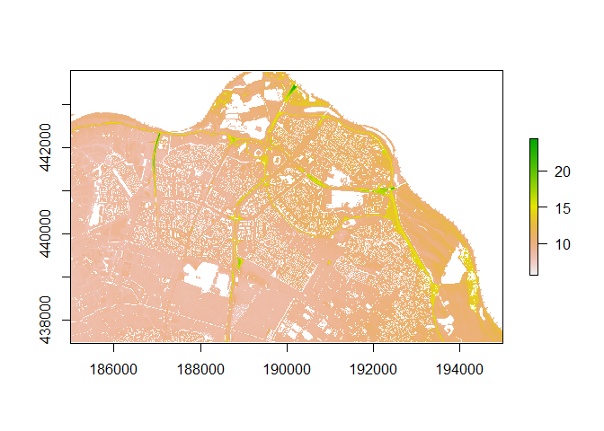 Unfortunately we have a gap for the river and on the North side of the river. It seems the buildings lack a DTM value as well, but this is less dramatic. Lets bring in a less accurate but all cover DEM.

``` r
rm(DTM_Arnhem_SW, DTM_Arnhem_SE)

DEM_srtm90 <- raster("input/srtm_38_02.tif")
values(DEM_srtm90) <- values(DEM_srtm90)
DEM_srtm90 <- crop(DEM_srtm90, extent(5.70, 6.09, 51.82, 52.02))
DEM_srtm90 <- projectRaster(DEM_srtm90, DTM, res = c(5, 5),  crs = DTM@crs)

#Create a complete DTM without gaps
DTM_full <- merge(DTM, DEM_srtm90)

#par(mfrow=c(1,3))
#plot(DTM)
#plot(DEM_srtm90)
plot(DTM_full)
```

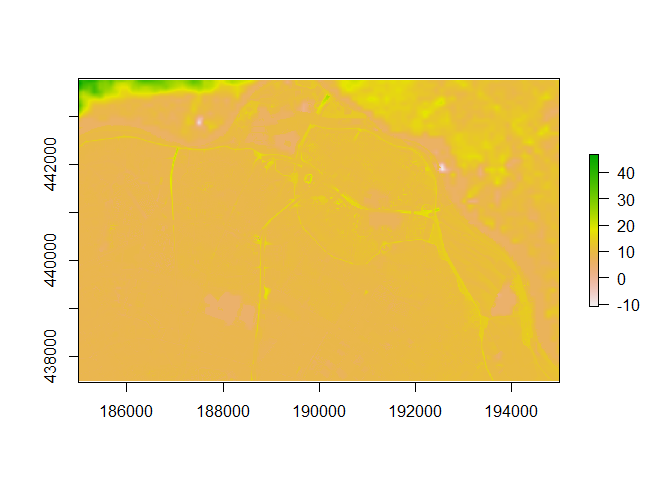

``` r
#par(mfrow=c(1,1))
```

The result looks reasonable.

``` r
rm(DEM_srtm90)

#This function returns the flooded area depending on the waterlevel in the Rhine
# src = the pinpointed location of the river from where the waterlevel will rise
calcFloodedArea <- function(waterLevel, DEM_Arnhem, src) {
  #divide the DEM in higher or lower then the waterlevel in the Rhine
  DEM_Arnhem <- DEM_Arnhem >= waterLevel
  DEM_Arnhem[DEM_Arnhem == 1] <- NA
  #run cumulativeCost function in 4 directions
  t4 <- transition(DEM_Arnhem, transitionFunction = function(x){1}, directions = 4)
  t4.acc <- accCost(t4, src)
  #return 1 for the flooded areas the rest is NA
  t4.acc[t4.acc == Inf] <- NA
  t4.acc[t4.acc > 0] <- 1
  return (t4.acc)
} 
```

Pinpoint points in the Rhine for the cumulative cost function

``` r
#For testing the points position spot on in the Rijn, plot the points
plot(DTM_full)
points(c(194350, 185900), c(439800, 442900))
```


``` r
src <- SpatialPoints(cbind(c(194350, 185900), c(439800, 442900)))
```

Create waterheight from 9.00m above NAP to 14.00m with steps of 0.2m And calculate the flooded areas for each level

``` r
waterHeight <- seq(from = 9, to = 14, by = 0.2)

floodedAreas <- sapply(waterHeight, FUN = calcFloodedArea, DEM_Arnhem = DTM_full, src = src)
names(floodedAreas) <- waterHeight
```

Run a quick visualization of the flooded areas

``` r
# n <- names(floodedAreas)
# l <- lapply(setNames(n, n), function(nameindex) {
#     plot(
#       floodedAreas[[nameindex]],
#       axes = FALSE,
#       legend = FALSE,
#       xlab = "",
#       ylab = "",
#       main = nameindex
#     )
#     return (NULL)
#   }
# )
```

Not surprisingly the results show a similar picture as with GEE. Though Arnhem North dropped of the map. The extent of the downloaded and merged AHN3 TIF images have not been changed.

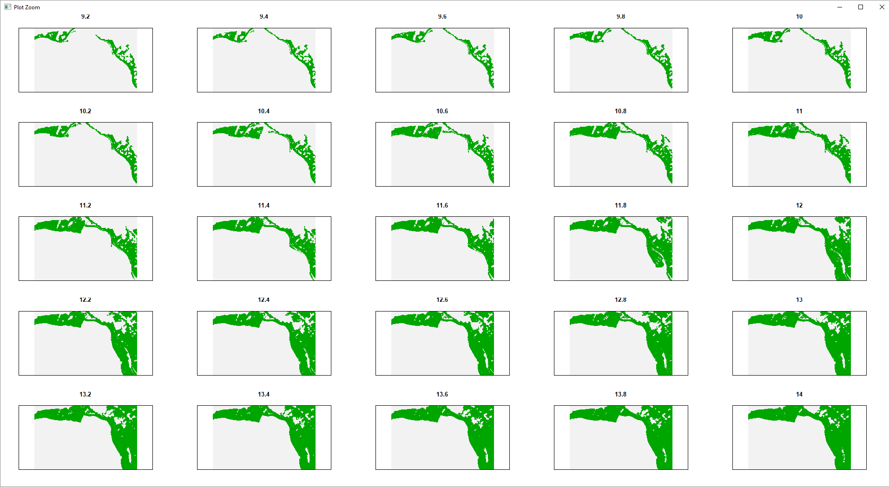

Floodwater of the Rhine from 9.20m – 14m above NAP using R: AHN3 5m + SRTM 90m

It looks quite reasonable for Arnhem South, but in the North (no support for AHN3 5m) it looks hopeless. The 90m resolution is just not usable as illustrated in the zoomed image below.

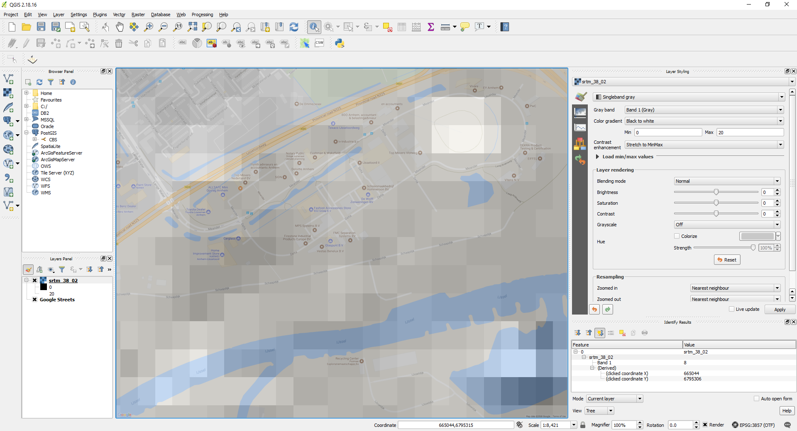

SRTM 90m resolution in QGIS zoomed on pixel level (white is high and black is low elevation)

The dikes are simple not visible with 90m resolution. The ‘whiter’ areas in the river are a mystery, possible a mighty ghost ship.

The flooded areas are visible in the raster/image file. The dry areas are masked in the raster. The results are converted to polygons. Below a converted raster to polygon file is shown, the brand new sf library is holding the polygon object.

Let's convert a single flooded area to a vector (polygon) and visualize this

``` r
floodedArea12.8 <- floodedAreas[[20]]
floodedArea12.8[floodedArea12.8 == 0] <- NA

# This still doesn't work unfortunately
# pol <- rasterToPolygons(floodedArea12.8, fun=function(x){x == 1})
# pol is 2Gb+ (or simple doesn't finish)...
```

gdal\_polygonize
----------------

Convert the TIF to a shapefile using python!

``` r
source("gdal_polygonizeR.R")

#First export raster
writeRaster(floodedArea12.8, "output/RiverRijnArnhem_12_8m.tif", format = "GTiff", overwrite = T)

gdal_polygonizeR(
  "\\output\\RiverRijnArnhem_12_8m.tif", 
  outshape = "\\output\\RiverRijnArnhem_12_8m.shp", 
  pypath = file.path("C:\\gdal-2.2.3\\swig\\python\\scripts\\gdal_polygonize.py"),
  overwrite = T,
  directory = normalizePath('.')
)
```

SF library
----------

Lets see whether the python conversion worked. The new SF library is used to import the shapefile.

``` r
RiverRijnArnhem_12.8m <- st_read("output\\RiverRijnArnhem_12_8m.shp")
```

    ## Reading layer `RiverRijnArnhem_12_8m' from data source `C:\Users\Ruud\Documents\Werk\GIS\HoogwaterArnhemRijn\output\RiverRijnArnhem_12_8m.shp' using driver `ESRI Shapefile'
    ## Simple feature collection with 1 feature and 1 field
    ## geometry type:  POLYGON
    ## dimension:      XY
    ## bbox:           xmin: 185000 ymin: 437500 xmax: 195000 ymax: 443750
    ## epsg (SRID):    NA
    ## proj4string:    +proj=sterea +lat_0=52.15616055555555 +lon_0=5.38763888888889 +k=0.9999079 +x_0=155000 +y_0=463000 +ellps=bessel +units=m +no_defs

``` r
#Not sure why it lost its reference system when converting with gdal_polygonize (as it is within the tif raster)
RiverRijnArnhem_12.8m <- st_transform(RiverRijnArnhem_12.8m, 28992)
mapview(RiverRijnArnhem_12.8m)
```

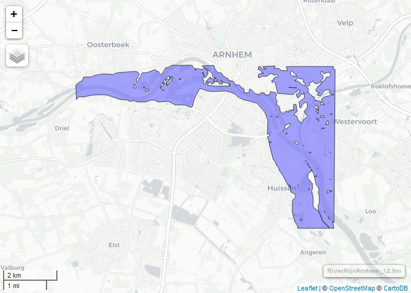

As already mentioned the results are poor. Let’s see whether we can use different datasets. The PDOK shows the existence of AHN2, which we used in GEE, however we cannot download it as with AHN3. Therefor we need to make use of WMS, WFS, WMTS or WCS services. These are logical standardized geo services. The client is no longer obliged to download large tile formats in case with regular download service. Now you can define exactly which piece of data you need. In case of WMS the value gets automatically translated to a pixel color. Though it is no longer possible to use the data elsewhere down the pipeline. WMTS solves (very simplistic explanation) some technical performance problems of WMS using caching techniques. In QGIS there is a handy PDOK plugin for quickly visualizing PDOK data. But you can do that as well in R.

WMS and Leaflet
---------------

The results are not particularly satisfying above the Rijn. The 90m SRTM is not useful for this data problem as within GEE.

Can we use AHN2 data to take careof the missing data in the North. There is no direct download, but PDOK provide a WMS and a WCS service.

``` r
leaflet() %>% 
  addTiles() %>% 
  setView(lat = 51.97, lng = 5.91, zoom = 13) %>%
  addWMSTiles(
    "http://geodata.nationaalgeoregister.nl/ahn2/wms?SERVICE=WMS&",
    layers = "ahn2_05m_int", #or ahn2_5m
    options = WMSTileOptions(format = "image/tiff", transparent = TRUE),
    attribution = ""
  ) #%>%
```

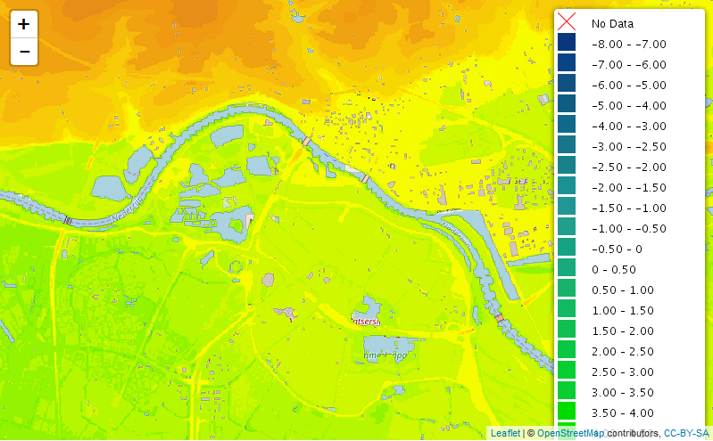

``` r
 #legend definitely needs customization, but that is for another time   
 # addWMSLegend(uri = paste0(
 #   "http://geodata.nationaalgeoregister.nl/ahn2/wms?SERVICE=WMS&",
 #   "REQUEST=GetLegendGraphic&VERSION=1.1.1", #Or 1.3.0
 #   "&FORMAT=image/tiff&LAYER=ahn2_05m_int"
 #   )
 # )
```

Or grab the image straight from the URL [WMS AHN2\_05m v1.1.1 interpolated](http://geodata.nationaalgeoregister.nl/ahn2/wms?SERVICE=WMS&REQUEST=GetMap&VERSION=1.1.1&LAYERS=ahn2_05m_int&STYLES=&FORMAT=image%2Ftiff&TRANSPARENT=true&HEIGHT=2048&WIDTH=2048&SRS=EPSG%3A3857&BBOX=650631.9847634202,6785162.126818524,665307.8941941741,6799838.036249279) [WMS AHN2\_5m v1.3.0](http://geodata.nationaalgeoregister.nl/ahn2/wms?SERVICE=WMS&REQUEST=GetMap&VERSION=1.3.0&LAYERS=ahn2_5m&STYLES=&FORMAT=image%2Ftiff&TRANSPARENT=false&HEIGHT=2048&WIDTH=2048&CRS=EPSG%3A3857&BBOX=650631,6785162,665307,6799838)

But we have no interest in the WMS service. We need the elevation data in the DEM, we need the WFS and the WCS services. The WFS provides features (vector, polygons…) while WCS supports raster/image data. So we need the WCS service from PDOK, <http://pdok-ngr.readthedocs.io/services.html#catalogue-service-for-the-web-csw>.

WCS
---

Unfortunately, I got an error in R when downloading this data. The mistake is not so much in R though, but it might be related with some underlying GDAL libraries.

Let's use the WCS and download the data (similar as wfs for features, but now for raster data)

``` r
#wcs = "https://geodata.nationaalgeoregister.nl/ahn2/wcs?"
#wcsGdal <- newXMLNode("WCS_GDAL")
#wcsGdal.serviceURL <- newXMLNode("ServiceURL", wcs, parent=wcsGdal)
#wcsGdal.layer <- newXMLNode("CoverageName", "ahn2__ahn2_5m", parent=wcsGdal)
#wcsGdal.xml = "output\\ahn_2_5m.xml"
#saveXML(wcsGdal, file = wcsGdal.xml)
 
#unfortunately I get in both cases errors using gdalinfo
#gdalinfo(wcsGdal.xml, verbose = T)
#system("OSGeo4W", input = paste0("gdalinfo ",normalizePath('.'),"\\", wcsGdal.xml))

# Checking gdal_installation...
# Scanning for GDAL installations...
# Checking the gdalUtils_gdalPath option...
# GDAL version 2.2.3
# GDAL command being used: "C:\OSGeo4W64\bin\gdalinfo.exe" "input\ahn_2_5m.xml"
# ERROR 1: SSL certificate problem: self signed certificate in certificate chaingdalinfo failed - unable to open 'input\ahn_2_5m.xml'.
# [1] "ERROR 1: SSL certificate problem: self signed certificate in certificate chain"
# [2] "gdalinfo failed - unable to open 'input\\ahn_2_5m.xml'."                       
# attr(,"status")
# [1] 1
# Warning message:
#   running command '"C:\OSGeo4W64\bin\gdalinfo.exe" "input\ahn_2_5m.xml"' had status 1 
```

Normally when this works you can grab the tif with gdal\_translate. Detailed example: <http://gsif.isric.org/doku.php/wiki:tutorial_soilgrids>

This is a setback, I am not sure how to solve this. The following Dutch site explains some things and why it works in QGIS (which is similar). <https://www.pdok.nl/sites/default/files/forum_attachments/user_484/ogc_wms_en_wfs_beveiligd_met_pki-certificaten_v0.1.pdf>

Now we downloaded the file via QGIS manually (make sure you set the map extent), which is fine for now as it is a single file

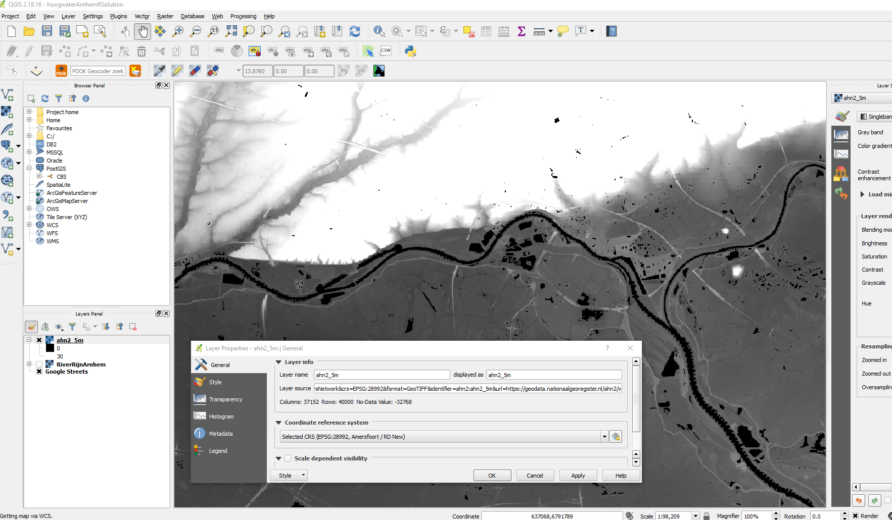 QGIS visualization of the PDOK WCS AHN2 5m

After downloading the AHN2 5m with QGIS (don’t download everything), the AHN3 is merged with AHN2. Then we set the unknown elevations on 0m, no more SRTM 90m resolution DEM. The unknown elevations are mostly the Rhine and some buildings. This is fine in our case as the buildings are not bordering the Rhine.

``` r
DEM_ahn2 <- raster("input/wcs_Ahn2_5m.tif") #AHN2, DEM not dtm, downloaded using wcs in qgis, with a certain mapextent 
values(DEM_ahn2) <- values(DEM_ahn2)
DEM_Ahn2_reproj <- projectRaster(DEM_ahn2, DTM, res = c(5, 5),  crs = DTM@crs)
#plot(DEM_Ahn2_reproj)

#Update some weird extremely negative values
DEM_Ahn2_reproj[DEM_Ahn2_reproj < 0] <- 0
#plot(DEM_Ahn2_reproj)

#Put the NA values on 0 which is fine for our problem
DEM_Ahn2_reproj[is.na(DEM_Ahn2_reproj)] <- 0
plot(DEM_Ahn2_reproj)
```

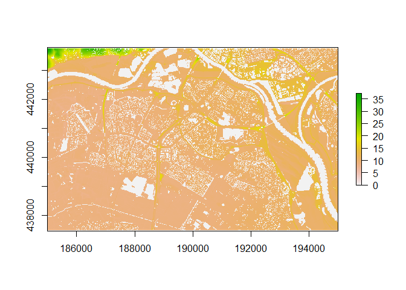

``` r
#merge the DEM's, first the AHN3 data and if not available the AHN2 data
DTM2 <- merge(DTM, DEM_Ahn2_reproj)
plot(DTM2)
```


Bridges
-------

Hmmm there seem to be some issues with the bridges. Unfortunately some manual work was needed for the bridges, and in a few buildings to close to the water (0,5m resolution would have prevented this). This could be automated using a bridge detection filter and connect the docks on both sides of the bridge. Or the AHN DTM solves this, this seems the most logical place. In QGIS it is quite easy to manually adapt single pixel values with the Serval plugin.

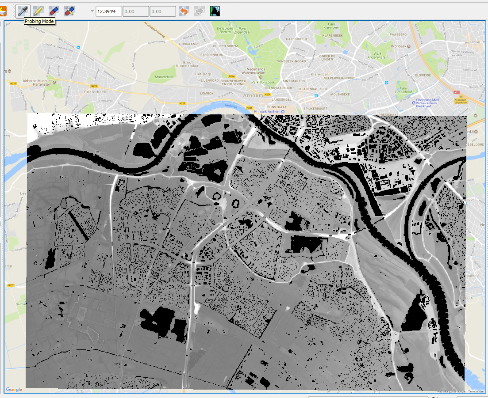 QGIS AHN2 + AHN3 + bridge correction 5m resolution (extent of the AHN3 near Arnhem)

``` r
writeRaster(DTM2, "output\\DEM_merged.tif", overwrite = TRUE)
DTM2 <- raster("output\\DEM_merged_bridgesAdapted.tif")
plot(DTM2)
```

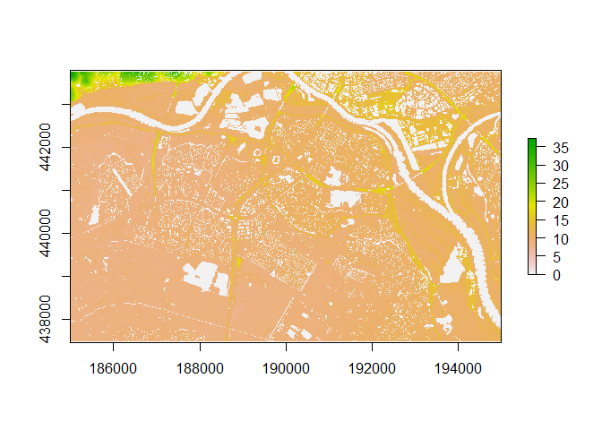 This looks ok now Recalculate the floodedAreas and export the rasters

``` r
floodedAreas <- sapply(waterHeight, FUN = calcFloodedArea, DEM_Arnhem = DTM2, src = src)
names(floodedAreas) <- waterHeight
n <- names(floodedAreas)

l <- lapply(setNames(n, n), function(nameindex) {
  writeRaster(
    floodedAreas[[nameindex]],
    paste0("output\\RiverRijnArnhemHoogwater", ifelse(as.numeric(nameindex) %% 1 != 0, paste0(str_replace(nameindex, "[.]", "-"),"0"), paste0(nameindex,"-00") ), ".tif"),
    overwrite = TRUE
  )
  return (NULL)
})
```

Visualize the data

``` r
# l <- lapply(setNames(n, n), function(nameindex) {
#   plot(
#     floodedAreas[[nameindex]],
#     axes = FALSE,
#     legend = FALSE,
#     xlab = "",
#     ylab = "",
#     main = nameindex
#   )
#   return (NULL)
# }
# )
```

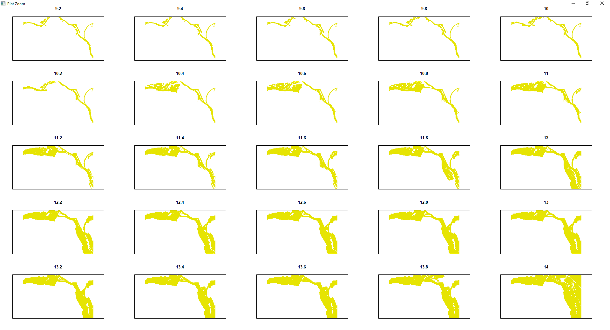

Water level near the Rhine from 9.20m – 14m above NAP using R: AHN3 5m + AHN2 5m + bridge correction

The new TIF images are imported in QGIS and exported for integration in Power BI. The Power BI solution can be viewed on: [Power BI](https://app.powerbi.com/view?r=eyJrIjoiNGQ0NDQyM2ItMWRlNS00YzQ2LTgwOTEtMTVkOTJiMWM3OTMyIiwidCI6Ijg3NGM1MzA1LWI0MDktNGU5Ni04ODhiLTQ4ODViNWQ0ZDYwNiIsImMiOjl9).

The results look reasonable realistic, unfortunately the floodwater disappeared. But there is still some snow in the Alps, so we might get another spike this year. I am curious to see if it is reasonable or whether I can better stick to chess.

The GEE code can be found here (you need a GEE account): [GEE link](https://code.earthengine.google.com/234fae4c5055778f436e4e627d073721)

In the following [YouTube](https://www.youtube.com/watch?v=6fluUIGW00Y) video you can see the animated generated images.
